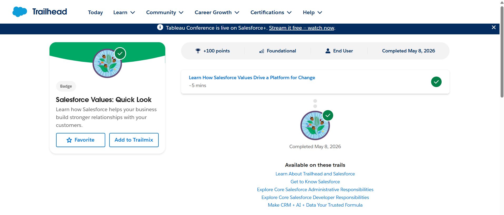
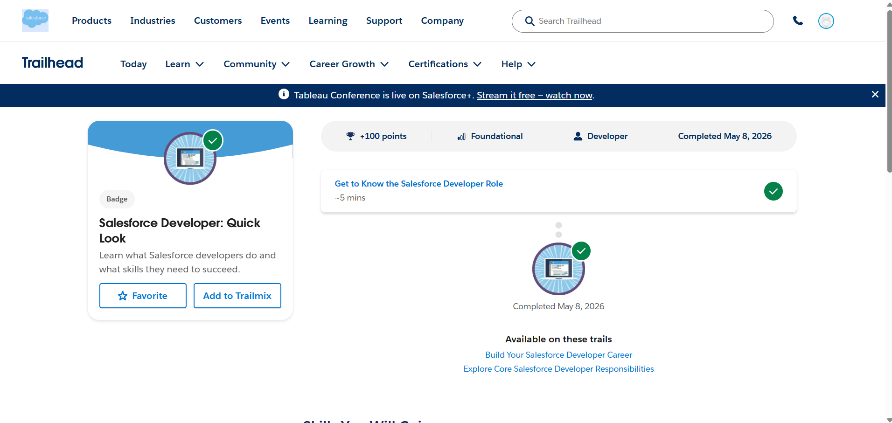
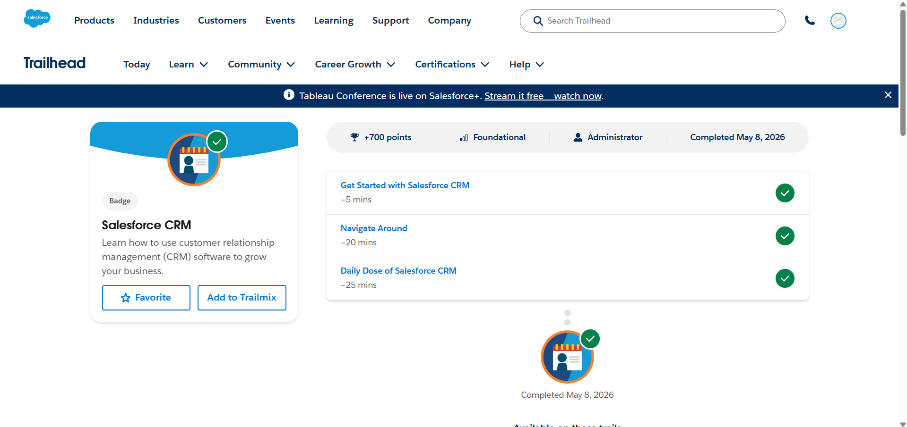
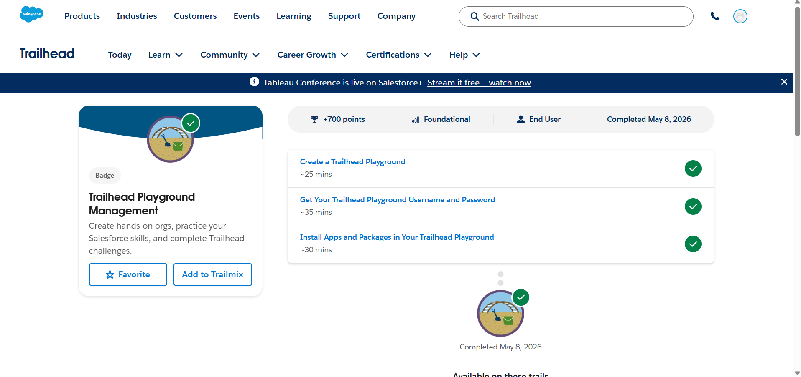

1.What is CRM?
CRM stands for Customer Relationship Management. It is a strategy and technology used by businesses to manage interactions with customers and potential customers. CRM helps organizations improve customer relationships, streamline business processes, and increase profitability.
2.Why Companies Use Salesforce
Salesforce is one of the leading CRM platforms because it provides a unified cloud-based solution for businesses. Companies use Salesforce to:
Connect marketing, sales, and customer service teams on a single platform.
Gain a 360-degree view of customers and their interactions.
Improve efficiency using automation and AI-powered tools.
Scale operations for both small businesses and large enterprises.
3.Core Salesforce Terminology
Account: Represents a company or organization that has a relationship with the business.
Contact: Represents an individual associated with an account.
Opportunity: Represents a potential sales deal being tracked in the sales pipeline.
4.Real-World Mapping: College Admission System
Salesforce Term	College Admission Mapping
Account	University or College
Contact	Student
Lead	Student inquiry or applicant
Opportunity	Admission application process
5.Business Flow: Lead → Contact → Opportunity → Customer
Lead: A person shows initial interest in a service or product.
Contact: After qualification, the lead becomes a known contact in the system.
Opportunity: A potential deal or transaction is identified and tracked.
Customer: Once the deal is successfully completed, the person or organization becomes a customer.
6.Trailhead Progress I have successfully completed the following modules for Day 1: Salesforce Values: Quick Look Salesforce Developer: Quick Look Salesforce CRM Trailhead Playground Management
## 7. Screenshots of Trailhead Completion

### Salesforce Values: Quick Look

### Salesforce Developer: Quick Look

### Salesforce CRM

### Trailhead Playground Management

